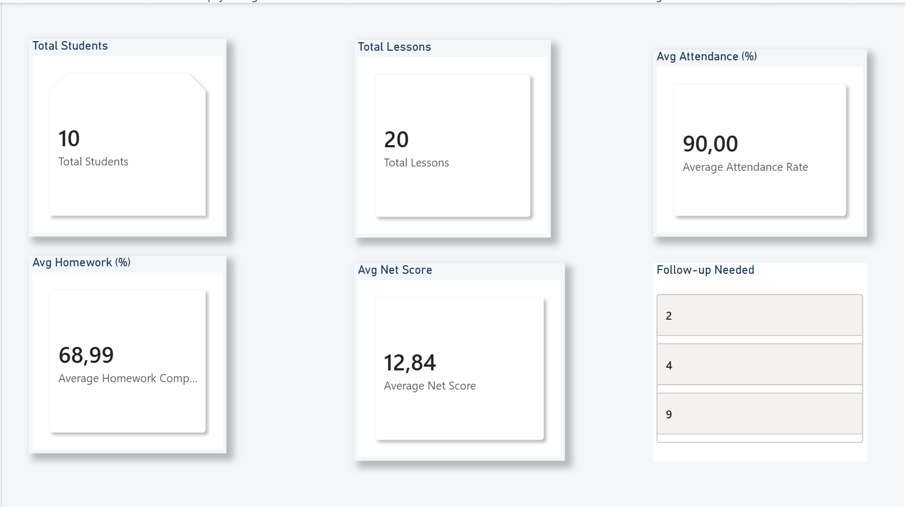
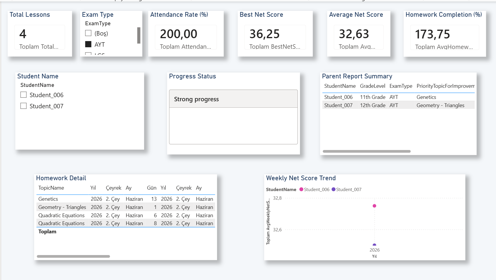
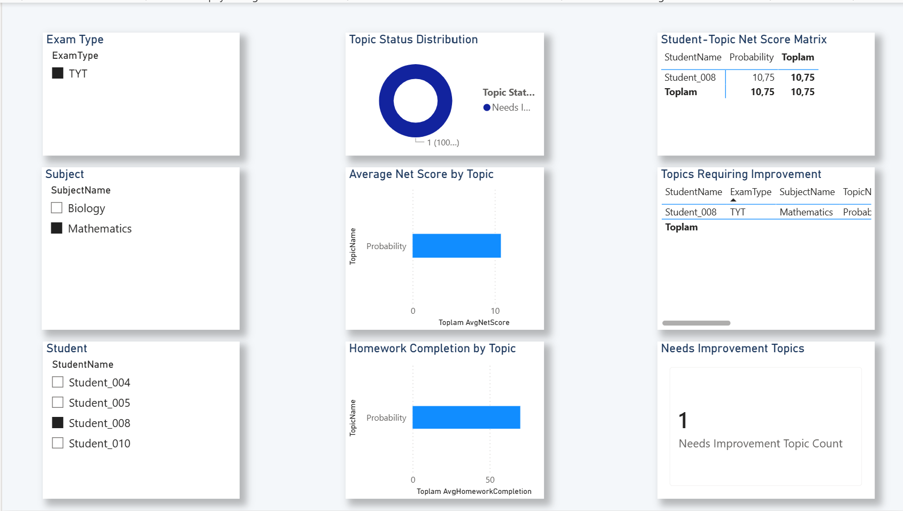

# Student Progress Analytics System

## Project Overview

This project is a SQL-based student progress tracking and analytics system designed for an online tutoring environment.

The main goal is to track students' lessons, homework completion, assessment results, topic-based performance, and overall progress. The system is designed to support teachers in monitoring student development and generating parent-friendly progress reports.

## Business Problem

In online tutoring, student progress is often tracked manually through notes, spreadsheets, or informal communication. This makes it difficult to consistently monitor:

- Which topics were covered
- Whether homework was completed
- How assessment scores changed over time
- Which topics need improvement
- What should be reported to parents

This project aims to create a structured data model and analytics layer for student progress tracking.

## Solution

The system uses a relational database structure to store student, lesson, homework, assessment, and topic data. SQL queries are used for data quality checks, performance analysis, and creating analytical views for Power BI dashboards.

## Tools & Technologies

- SQL Server
- Power BI
- Excel / CSV
- Data Modeling
- Data Analysis
- Dashboard Design
- Power Apps and Power Automate planned for future improvement

## Main Components

- Student information tracking
- Lesson history tracking
- Homework completion analysis
- Assessment and net score analysis
- Topic-based performance tracking
- Parent report dashboard

## Dataset

The dataset used in this project is fully synthetic and does not contain any real student information.

## Project Workflow

The project follows a structured analytics workflow:

1. Synthetic student progress data was created.
2. A relational database model was designed in SQL Server.
3. SQL scripts were used to create tables and insert sample data.
4. Data quality checks were performed using SQL queries.
5. Analytical SQL queries were written to evaluate student progress.
6. SQL views were created for Power BI reporting.
7. A Power BI dashboard was developed with student, topic, and parent report pages.

---

## Database Structure

The database includes the following main tables:

- Students
- Subjects
- Topics
- Lessons
- Homework
- Assessments
- TopicMastery

These tables are connected through primary and foreign key relationships to support structured student progress tracking.

---

## SQL Scripts

The SQL workflow is organized into separate scripts:

- `01_create_tables.sql`  
  Creates the database tables and relationships.

- `02_insert_sample_data.sql`  
  Inserts fully synthetic student, lesson, homework, assessment, and topic mastery data.

- `03_data_quality_checks.sql`  
  Performs data quality checks such as duplicate records, invalid status values, date inconsistencies, and orphan records.

- `04_analysis_queries.sql`  
  Includes SQL queries for student-level progress, homework performance, assessment performance, topic analysis, weak topic detection, attendance analysis, and parent report summaries.

- `05_create_views_for_powerbi.sql`  
  Creates SQL views used as the data source for the Power BI dashboard.

---

## Power BI Dashboard

The Power BI dashboard was designed to visualize student progress in an online tutoring environment.

The dashboard includes three main pages:

### 1. Student Overview

This page provides a general summary of student performance.

Key metrics include:

- Total students
- Total lessons
- Average attendance rate
- Average homework completion
- Average net score
- Students requiring follow-up

---

### 2. Topic Performance Analysis

This page focuses on topic-based student performance.

It helps identify:

- Strong topics
- Moderate topics
- Topics requiring improvement
- Student-topic level net score patterns
- Homework completion by topic

---

### 3. Parent Report

This page is designed as a parent-friendly progress report.

It summarizes:

- Student progress status
- Attendance rate
- Homework completion
- Average net score
- Strongest topic
- Priority topic for improvement
- Weekly net score trend

---

## Key Insights

This project demonstrates how SQL and Power BI can be used together to create a structured student progress tracking system.

Key analytical outputs include:

- Students requiring closer follow-up can be identified using attendance, homework completion, assessment performance, and topic mastery indicators.
- Topic-level performance analysis helps teachers prioritize the next learning focus for each student.
- Parent-friendly reports make student progress more visible and easier to communicate.
- SQL views provide a clean reporting layer for Power BI dashboards.

---

## Future Improvements

Planned improvements include:

- Adding a Power Apps form for lesson, homework, and assessment data entry
- Creating Power Automate flows for weekly parent report reminders
- Automating PDF parent report generation
- Adding student-level recommendation logic
- Expanding the dataset with more weeks and more students
- Creating a web-based version for real online tutoring operations

---

## Data Privacy Note

The dataset used in this project is fully synthetic.  
It does not contain any real student, parent, or personal information.
